<div align="center">
  
  <h1 style="display: inline-block; vertical-align: middle;">Recipes</h1>
</div>

[](https://github.com/OGSarah/Recipes/actions/workflows/swiftlint.yml)
[](https://github.com/OGSarah/Recipes/actions/workflows/tests.yml)

A Swift iOS recipe browser built with SwiftUI on top of [TheMealDB](https://www.themealdb.com) public API. Browse recipes by category and cuisine, search by name, read full recipes with ingredients and instructions, and save favorites locally for offline cooking.

> **CI note:** The suite is green locally on the Xcode 27 / iOS 27 beta toolchain. The GitHub Actions runners don't yet ship that toolchain, so the badges will stay red until they do. This is a runner-availability gap, not a test failure.


## Architecture

The app follows a layered, testable design. Views own no business logic; everything flows through `@Observable` view models that depend only on protocols, so each layer is replaceable and unit-testable in isolation. SwiftData and `URLSession` are implementation details hidden behind service protocols; the view models never import them.

```
App/          Composition root: AppDependencies (DI graph), RecipesApp (@main)
Models/       MealSummary, MealDetail (+Ingredient, flattening decoder),
              MealCategory, Area, MealImageSize, MealDBError (typed)
Services/     RecipeProviding  → LiveMealDBClient  (URLSession, async/await, off-main)
              MealDBEndpoint     (free V1 URL builder, test key "1")
              FavoritesStoring  → SwiftDataFavoritesStore (persistence)
ViewModels/   Browse / MealList / Search / Favorites / RecipeDetail (@Observable, @MainActor)
Views/        RootTabView shell + Browse / Search / Favorites / Detail + reusable Components
Persistence/  FavoriteRecipe (@Model)
```

**Key decisions**

| Decision | Why |
|:---|:---|
| `@Observable` view models, no Combine | Modern Swift state with `async/await`; one view model per tab, each tested through mocks. |
| Protocol seams (`RecipeProviding`, `FavoritesStoring`) | View models depend on abstractions, so tests inject mocks; no network or SwiftData required. |
| Plain `AppDependencies` struct for DI | Init-injection with a live default is the idiomatic "container"; no third-party DI framework. |
| Typed `MealDBError: LocalizedError` | Replaces untyped errors; call sites and tests switch on exact cases (`.noResults`, `.badStatus`, …). |
| `nonisolated`, `Sendable` network client | Requests and JSON decoding run off the main actor so the UI stays responsive. |
| SwiftData behind `FavoritesStoring` | SwiftData is an implementation detail, not the architecture, so the view models never import it. |
| Custom `Decodable` for the 20 flat ingredient fields | TheMealDB encodes ingredients as `strIngredient1…20`/`strMeasure1…20`; a dynamic-key decoder flattens them in one place. |
| iOS 27 `AsyncImage(request:)` + `asyncImageURLSession` | A shared `URLCache` keeps thumbnails from re-downloading on scroll-back. |


## TheMealDB API

The app talks only to TheMealDB's **free V1 endpoints** using the public developer test key `1`:

| Feature | Endpoint |
|:---|:---|
| Browse categories | `categories.php` |
| Browse cuisines | `list.php?a=list` |
| Meals by category / area | `filter.php?c=…` / `filter.php?a=…` |
| Search by name | `search.php?s=…` |
| Full recipe lookup | `lookup.php?i=…` |

No premium V2 features (multi-random, latest, multi-ingredient filters) are used. `filter.php` returns only id/name/thumbnail, so opening a meal performs a `lookup.php` for the full recipe.

### API & Licensing

This project uses TheMealDB's **free test key `1`** strictly for development and as a portfolio demonstration. Per [TheMealDB's terms](https://www.themealdb.com/api.php), shipping publicly on the App Store requires becoming a supporter for a production key, so this app is **not intended for App Store release** as configured. Recipe data and images are © their respective owners via TheMealDB.


## Features

- **Browse**: categories in an adaptive grid and cuisines (areas) in a list, each drilling into a filtered meal list.
- **Search**: debounced (300 ms), cancellable name search with a minimum query length and empty/no-result states.
- **Recipe detail**: hero image, category/area chips, ingredient list with measures, full instructions, and YouTube / source links.
- **Favorites**: one-tap heart toggle persisted with SwiftData; favorites render fully **offline** and support swipe-to-delete.
- **Resilient networking**: typed errors, off-main decoding, structured-concurrency cancellation, and retryable error states.
- **Cached images**: `AsyncImage(request:)` over a shared `URLCache`, with resized TheMealDB thumbnail variants for lists.
- **Modern SwiftUI**: `TabView` + per-tab `NavigationStack`, value-based navigation, adaptive dark/light previews, and accessibility identifiers throughout.


## Screenshots

Captured on iPhone 17 (iOS 27).

| Screen | Light | Dark |
| :--- | :---: | :---: |
| Browse (Categories) | 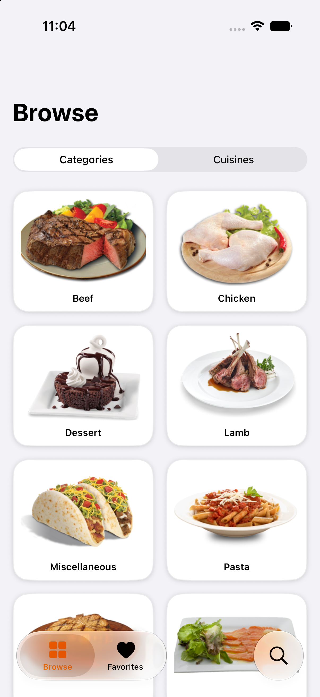 | 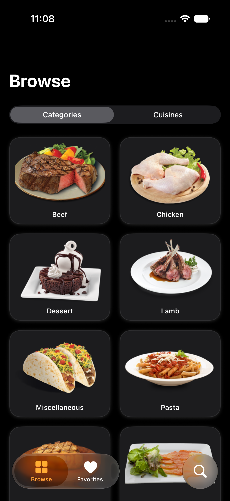 |
| Browse (Cuisines) | 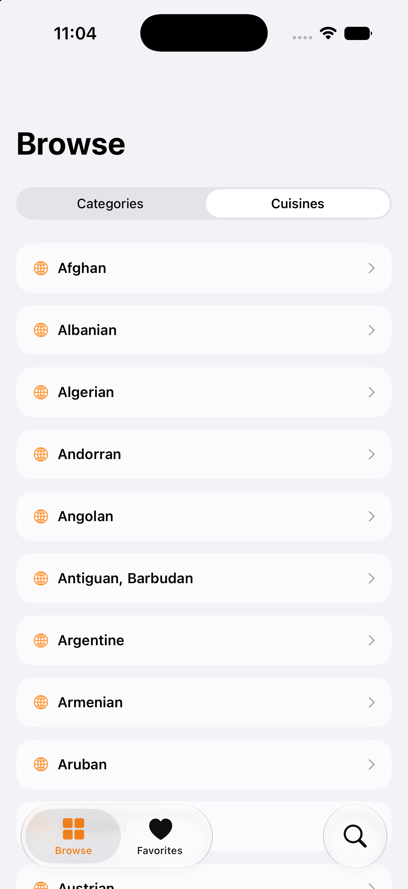 | 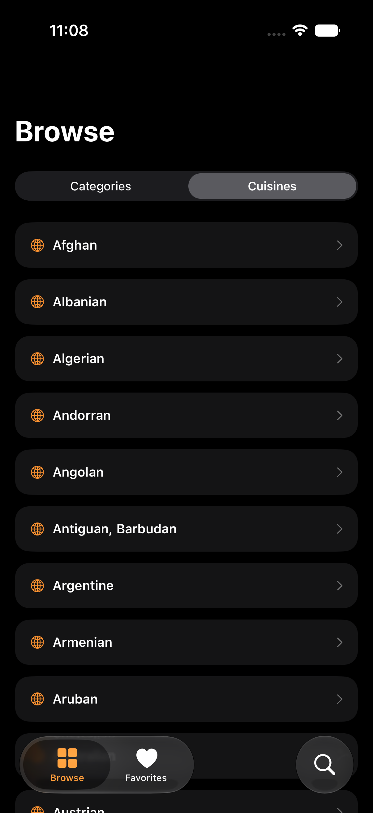 |
| Meal list | 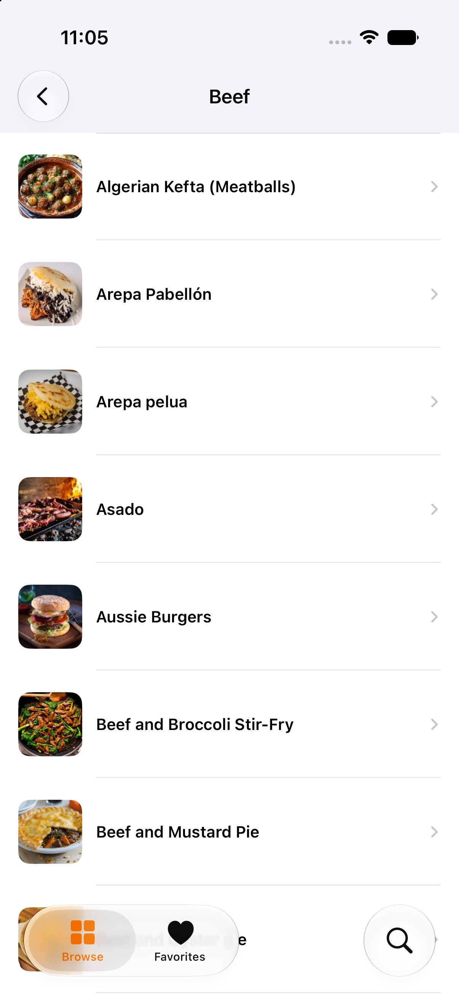 | 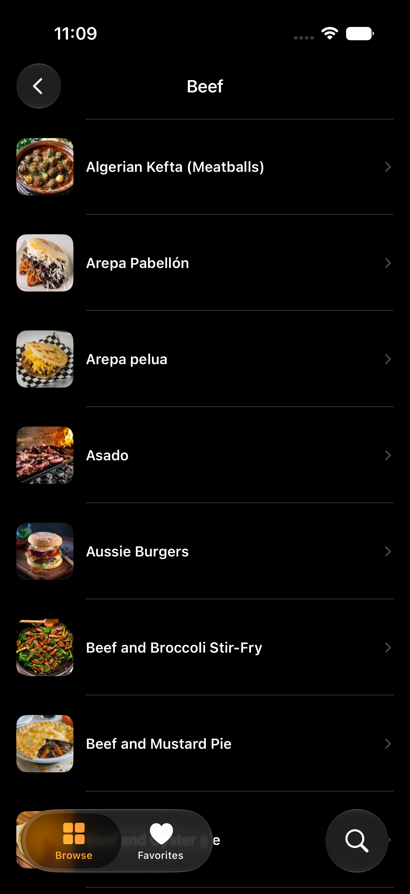 |
| Recipe detail | 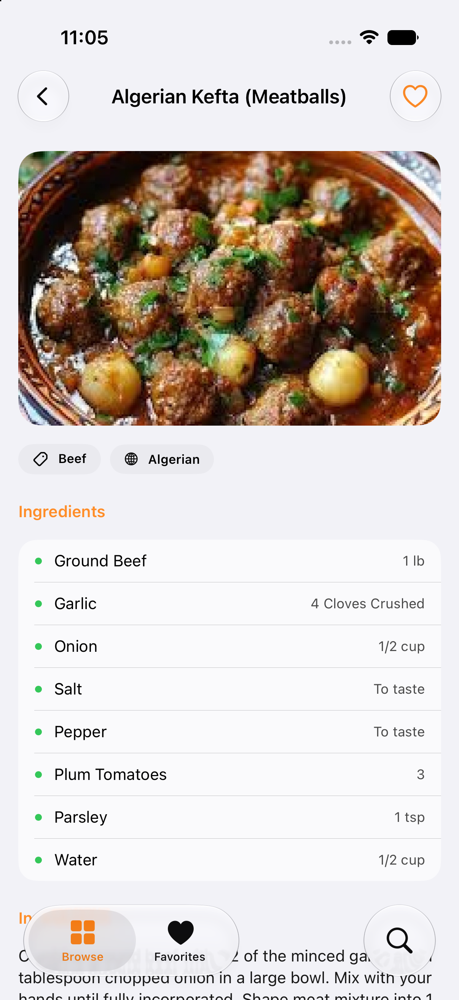 | 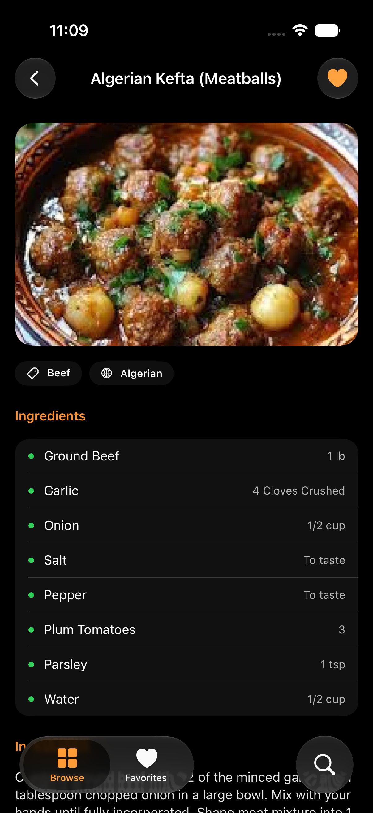 |
| Search | 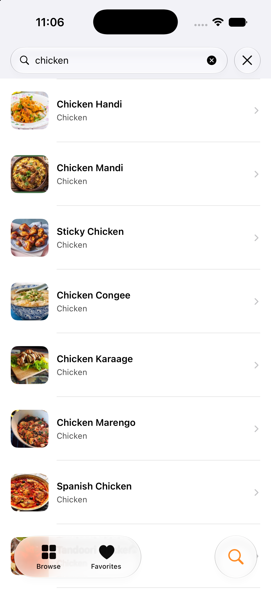 | 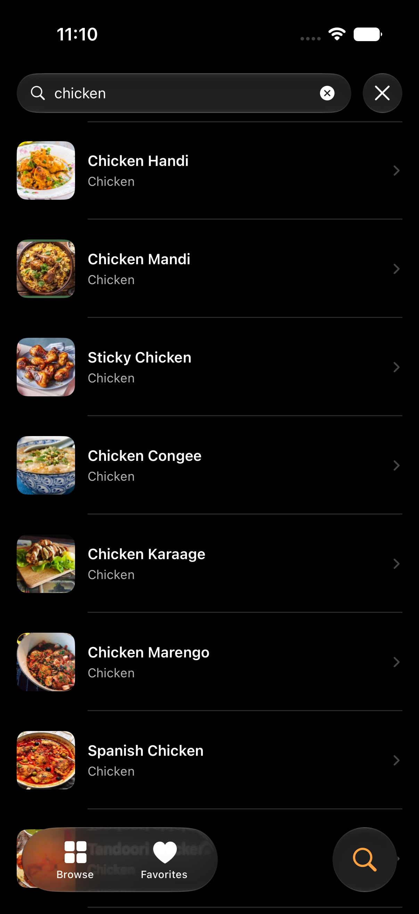 |
| Favorites | 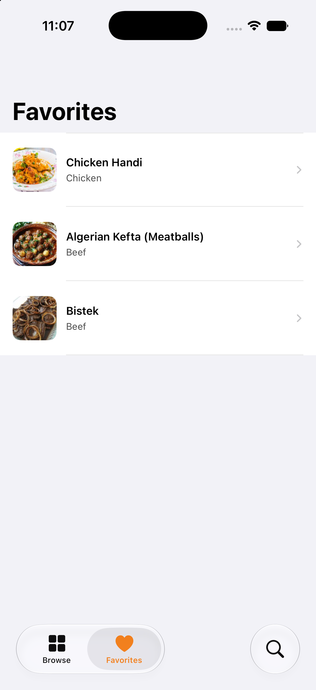 | 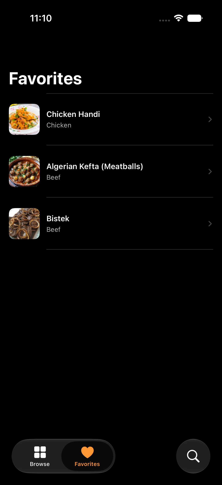 |


## Language, Frameworks, & Tools

- Swift 6 (strict concurrency, default `@MainActor` isolation)
- SwiftUI + Observation (`@Observable`)
- SwiftData (favorites persistence)
- iOS 27 / Xcode 27
- `URLSession` async/await networking
- Swift Testing (logic) + XCTest / XCUIAutomation (view models & UI)
- SwiftLint
- GitHub Actions (CI)


## Testing

The suite is split by what it verifies; the protocol seams make business logic testable without the network or disk.

| Suite | Layer | Coverage |
|:---|:---|:---|
| `MealDecodingTests` | Models | Flattening of the 20 ingredient/measure fields, tag splitting, URL parsing, `meals: null` handling, summary/category/area decode. |
| `LiveMealDBClientTests` | Networking | URL building per endpoint, success decode, non-2xx → `.badStatus`, `meals: null` → `[]` / `.noResults`, malformed JSON → `.decoding`, via a `StubURLProtocol`. |
| `FavoriteRecipeMappingTests` | Persistence | `MealDetail` ⇄ `FavoriteRecipe` round-trip, including ingredient flattening and empty-measure handling. |
| `BrowseViewModelTests` | View model | Category/area loading and typed error surfacing. |
| `SearchViewModelTests` | View model | Min-length guard, query trimming, results mapping, error clears results. |
| `FavoritesViewModelTests` | View model | Load and remove against a mock store. |
| `RecipeDetailViewModelTests` | View model | Summary→lookup vs. detail-in-hand paths, favorite toggle. |
| `RecipesUITests` | UI | Tab navigation, search → favorite → appears in Favorites, browse categories; hermetic via the `-uitest-stub` launch argument. |

Pure-logic suites use **Swift Testing** (`@Suite`/`@Test`/`#expect`). The `@MainActor` view-model and persistence suites use **XCTest**, and UI tests use **XCUIAutomation**. This split is deliberate: on the current iOS 27 beta toolchain, app-hosted Swift Testing suites isolated to a global actor crash the runner, and a SwiftData `fetch` against a `@testable`-imported `@Model` traps inside the test bundle. The store's CRUD is verified in the running app; its mapping and the favorites flow are unit-tested above.


## License

Released under the [MIT License](LICENSE). © 2026 SarahUniverse
